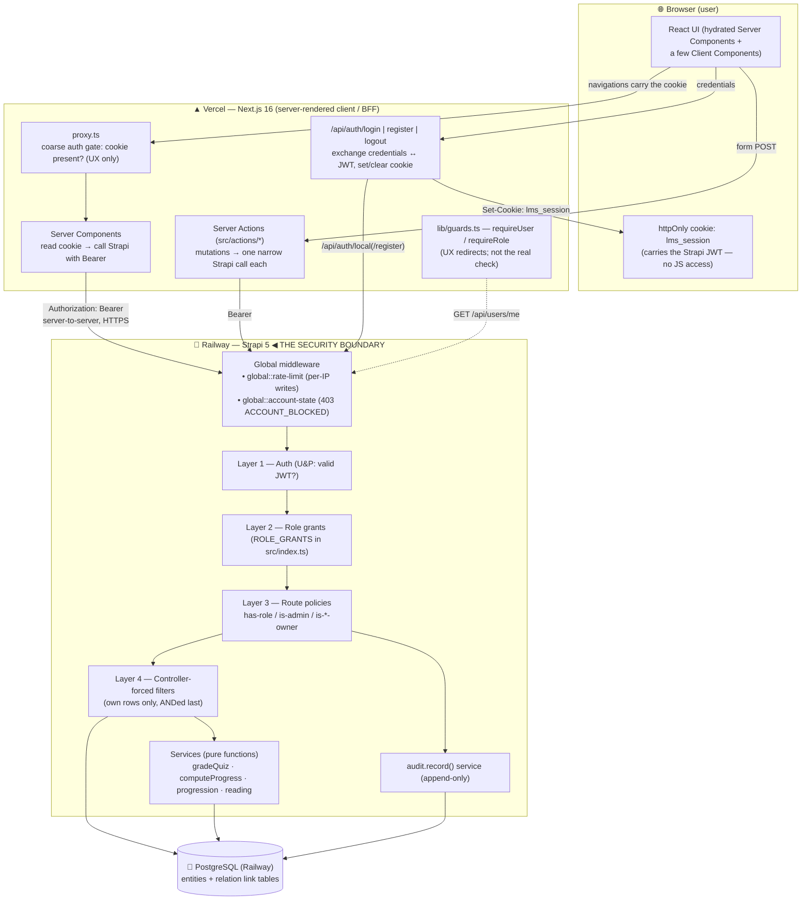
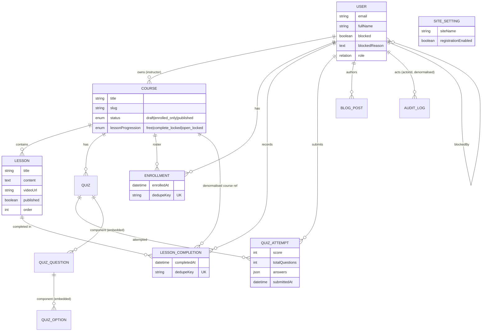
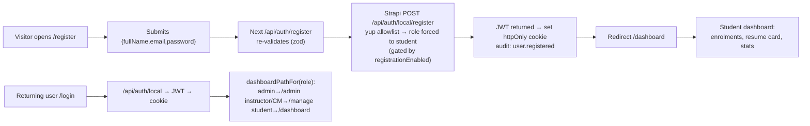
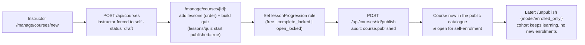
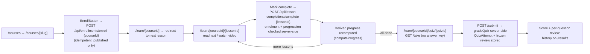
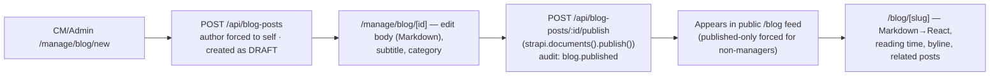
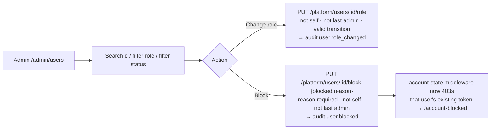
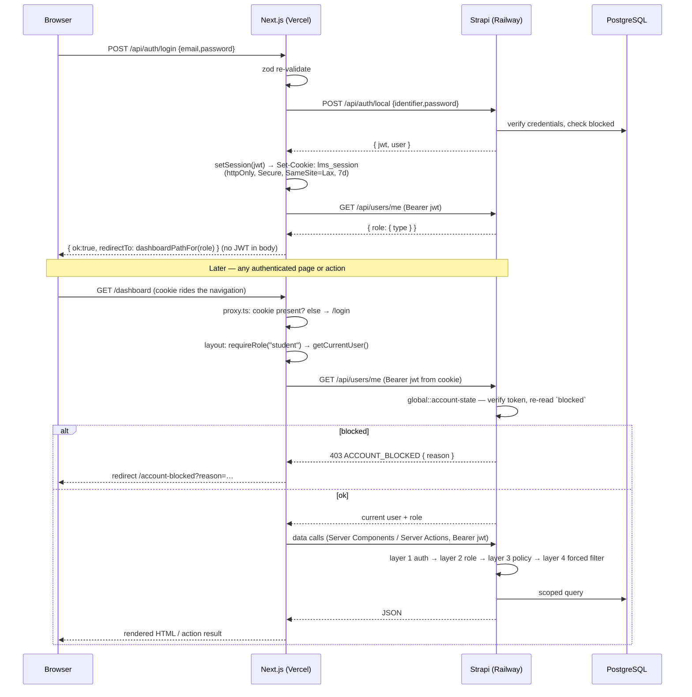

# Lernexa — Project Overview & System Documentation

> A single document that lets a new developer, interviewer, or reviewer understand the
> whole system in ~10–15 minutes without reading source. Every statement below was
> checked against the actual code in this repository; where the repo is ambiguous it is
> marked **"Not confirmed from repository"**.

**Companion docs:** [`ARCHITECTURE.md`](ARCHITECTURE.md) · [`DATA_MODEL.md`](DATA_MODEL.md) ·
[`RBAC.md`](RBAC.md) · [`DECISIONS.md`](DECISIONS.md) · [`PERFORMANCE.md`](PERFORMANCE.md) ·
[`ADMIN_PANEL.md`](ADMIN_PANEL.md) · [`DESIGN_SYSTEM.md`](DESIGN_SYSTEM.md) ·
[`ENGINEERING.md`](ENGINEERING.md) · [`IMPLEMENTATION_CHECKLIST.md`](IMPLEMENTATION_CHECKLIST.md)

---

## Table of contents

1. [Project Overview](#1-project-overview)
2. [Technology Stack](#2-technology-stack)
3. [System Architecture](#3-system-architecture)
4. [User Roles & RBAC](#4-user-roles--rbac)
5. [Complete Feature Map](#5-complete-feature-map)
6. [Page / Route Map](#6-page--route-map)
7. [Backend API Map](#7-backend-api-map)
8. [Database / Data Model](#8-database--data-model)
9. [Important User Flows](#9-important-user-flows)
10. [Authentication Flow](#10-authentication-flow)
11. [Course Lifecycle](#11-course-lifecycle)
12. [Blog Lifecycle](#12-blog-lifecycle)
13. [Frontend Structure](#13-frontend-structure)
14. [Backend Structure](#14-backend-structure)
15. [Deployment](#15-deployment)
16. [Testing](#16-testing)
17. [Security](#17-security)
18. [Important Technical Decisions](#18-important-technical-decisions)
19. [Known Limitations / TODOs](#19-known-limitations--todos)
20. [Lernexa in 2 Minutes](#20-lernexa-in-2-minutes)
21. [Visual Summary](#21-visual-summary)

---

## 1. Project Overview

### What Lernexa is

Lernexa is a **Learning Management System (LMS)** — a web platform where instructors
publish courses made of ordered lessons and quizzes, and students enrol, work through
the material, take quizzes, and track their progress. It is a two-app system: a
**Next.js 16** server-rendered frontend and a **Strapi 5** headless CMS / API backend,
backed by **PostgreSQL**.

### Main purpose of the platform

The product thesis, stated in the root [`README.md`](../README.md) and
[`ENGINEERING.md`](ENGINEERING.md), is **"progress, not catalogue"** — every screen
answers *"where am I?"* before *"what's available?"*. Concretely that means:

- Progress is **derived from completion facts**, never stored as a number a client could
  tamper with (D-003).
- Quizzes are **graded on the server**; the answer key (`isCorrect`) never reaches a
  student's browser (D-004).
- A clean, leak-free **4-role access-control model** is treated as a first-class
  deliverable, enforced in the backend, not by hiding buttons ([`RBAC.md`](RBAC.md)).

### Target users

| Audience | What they do on Lernexa |
|---|---|
| **Students** | Browse the catalogue, enrol, read lessons / watch lesson videos, take quizzes, see their progress and quiz history. |
| **Instructors** | Create and manage **their own** courses, lessons, quizzes; manage each course's roster; watch a "which students are stuck?" progress table. |
| **Content Managers** | Do everything an instructor can on **any** course, plus write and publish blog posts. |
| **Admins** | All of the above (except enrolling / taking quizzes) plus user & role management, blocking, the audit log, and site settings. |

### Main features

- Email/password **registration & login** with a server-held session (httpOnly cookie).
- **Course authoring**: courses → ordered lessons (text and/or video URL) → one MCQ quiz per course.
- **Course visibility control**: `draft` → `enrolled_only` → `published`, owner-toggled (D-039/D-040).
- **Per-course lesson progression rule**: `free`, `complete_locked`, or `open_locked` (D-038).
- **Self-enrolment** for students; **roster management** (add/remove by email) for course owners.
- **Derived progress** per course + a **batched instructor progress table** (2 queries for all students).
- **Server-side quiz grading** with an immutable, self-contained **attempt review snapshot** (D-037).
- **Blog** with Strapi's native Draft & Publish; public feed shows published posts only.
- **Admin panel** (built in Next.js, *not* the Strapi back office): user list with search/filters, role changes, blocking with reason, platform stats + "attention queue", and an **append-only audit log**.
- **Site-wide server-side search** (`$containsi`) on the catalogue, manage list, blog, users table, and audit log (D-035).
- **Light / dark / system theming** with no flash of the wrong theme (D-032).

---

## 2. Technology Stack

### Frontend

| Technology | Version (from `frontend/package.json`) | What it's used for |
|---|---|---|
| **Next.js** | `16.3.3` | App Router, React Server Components, Server Actions, route handlers, `proxy.ts` edge gate, security headers. The entire UI + BFF layer. |
| **React** | `19.2.8` | Component model. Server Components by default; `"use client"` only for real interactivity (forms, quiz taker, theme switcher, tables with filters). |
| **TypeScript** | `^5` | Both apps are TypeScript. |
| **Tailwind CSS** | `^4` (`@tailwindcss/postcss`) | Styling. Design system is token-based so colours flip between light/dark palettes with one set of components ([`DESIGN_SYSTEM.md`](DESIGN_SYSTEM.md)). |
| **zod** | `^4.4.3` | Form + Server Action input validation. Schemas in `src/lib/schemas.ts`, shared by client form (UX) and server (re-validation). |
| **react-markdown** + **remark-gfm** | `^9.1.0` / `^4.0.1` | Renders blog post bodies from Markdown to React elements — **no raw-HTML pass-through** (no `rehype-raw`), which keeps the blog XSS surface small. |
| **server-only** | `^0.0.1` | Build-time guard: importing `src/lib/strapi.ts` (or `session.ts`) from a client component fails the build, so the JWT can never reach the browser. |
| **IBM Plex Sans / Serif / Mono** | via `next/font/google` | One superfamily: Sans for UI, Serif for long-form reading (lessons, blog), Mono for ids/timestamps. |

### Backend

| Technology | Version (from `backend/package.json`) | What it's used for |
|---|---|---|
| **Strapi** | `5.52.2` | Headless CMS + REST API. **The security boundary** — the only thing that touches the database. Content types, controllers, routes, policies, services, lifecycle hooks, bootstrap. |
| **@strapi/plugin-users-permissions** | `5.52.2` | End-user auth (JWT), the `role` model, and the base permission system that layer 2 grants sit on. Extended in `src/extensions/users-permissions/`. |
| **@strapi/plugin-cloud** | `5.52.2` | Strapi Cloud helper plugin (present by default; deployment here is Railway, not Strapi Cloud). |
| **@strapi/database** | `5.52.2` | Query engine / Knex layer; used directly by hand-written migrations. |
| **pg** | `^8.13.1` | PostgreSQL driver. |
| **vitest** | `^3.2.7` | Test runner for both pure-function unit tests and integration suites. |
| **react / react-dom / react-router-dom / styled-components** | 18 / 6 / 6 | Strapi **admin panel** UI dependencies (Strapi's own back office), not the Lernexa product UI. |

### Database

- **PostgreSQL** everywhere — local and deployed. No SQLite fallback in practice
  (`config/database.ts` supports `sqlite`/`mysql`/`postgres`, but the README and
  [`ARCHITECTURE.md`](ARCHITECTURE.md) mandate Postgres because Railway's filesystem is
  ephemeral).
- Connection via `DATABASE_URL` (Railway injects it) or discrete `DATABASE_*` vars locally.
- `DATABASE_SSL=true` on Railway; `rejectUnauthorized` defaults to `false` because
  Railway's Postgres proxy presents a cert outside Node's trust store (connection is
  still encrypted).
- Strapi 5 stores each relation in its own **link table** (e.g. `enrollments_student_lnk`).

### Authentication

| Piece | Detail |
|---|---|
| **Token** | Strapi Users & Permissions **JWT**, `legacy-support` mode, **7-day fixed lifetime** (`config/plugins.ts`). No refresh-token rotation. |
| **Where it lives** | An **httpOnly, Secure (prod), SameSite=Lax** cookie named `lms_session` (`SESSION_COOKIE_NAME`), scoped to the Vercel domain. Set/cleared only by Next.js route handlers in `src/app/api/auth/*`. |
| **Browser exposure** | **None.** The browser never sees the JWT and never calls Strapi directly. All Strapi calls are server-to-server with an `Authorization: Bearer` header from `src/lib/strapi.ts`. |
| **Session read** | `getCurrentUser()` (`src/lib/session.ts`), wrapped in React `cache()`, calls `GET /api/users/me` once per render pass. |
| **Admin panel auth** | Separate — Strapi's own `ADMIN_JWT_SECRET`-signed admin sessions. Nobody logs into the Strapi back office to *use* Lernexa. |

### Deployment

| Layer | Host | Notes |
|---|---|---|
| Frontend | **Vercel**, root directory `frontend/` | `STRAPI_URL` is **server-only** (never `NEXT_PUBLIC_`). |
| Backend / API | **Railway**, root directory `backend/` | Build `npm run build`, start `npm run start`. |
| Database | **Railway Postgres** service | `DATABASE_URL` injected by the plugin. |
| Strapi admin | `<railway-url>/admin` | Strapi's own back office. |

Live URLs (from root `README.md`): frontend `https://frontend-xi-silk-30.vercel.app`,
API `https://lernexa-production.up.railway.app`.

### Important libraries / services — quick "why each exists"

| Library / mechanism | Why it's in the project |
|---|---|
| `server-only` | Hard wall between server code (which holds the JWT) and client bundles. |
| React `cache()` | De-dupes `getCurrentUser()` across multiple layouts in one render. |
| zod (frontend) / yup (backend register/updateMe) | Two independent validation layers — client for UX, server as the real allowlist (D-030). Deliberately not shared (different runtimes). |
| `revalidatePath` / `revalidateTag` | Cache invalidation after Server Action mutations. |
| In-memory rate-limit middleware | Per-IP ceiling on mutating `/api/*` traffic; U&P covers the auth endpoints (D-033). |
| `global::account-state` middleware | Re-checks `blocked` on **every** authenticated request → `403 ACCOUNT_BLOCKED` with reason (D-013). |
| Hand-written Knex migrations | Unique `dedupeKey` indexes + query indexes Strapi won't create from `schema.json`. |

---

## 3. System Architecture

### One-sentence architecture

> **Strapi is the security boundary and the only thing that touches the database;
> Next.js is a server-rendered client that holds the session cookie and never exposes
> the JWT to the browser.** ([`ARCHITECTURE.md`](ARCHITECTURE.md))

### Architecture diagram



### Data / request flow — "student marks a lesson complete" (the canonical example)

1. A Client Component calls the Server Action `markLessonComplete(lessonId)` (`src/actions/learning.ts`).
2. The action reads the `lms_session` cookie via `getToken()`.
3. It calls `POST /api/lesson-completions/complete` on Strapi with `Bearer <jwt>` and body `{ lessonId }` — **one id, nothing else**.
4. Strapi's global `account-state` middleware verifies the token and checks `blocked`.
5. Route policy `global::has-role { roles: ['student'] }` runs → 403 if not a student.
6. The controller resolves `ctx.state.user.id`. **It never reads a user id from the body.**
7. It loads the lesson → its course; verifies an `Enrollment` exists for `(user, course)` via the `dedupeKey` → 403 if not.
8. If the course's `lessonProgression` isn't `free`, the pure `canCompleteLesson(...)` gate must pass → 403 otherwise (D-038).
9. It upserts a `LessonCompletion` row keyed on `dedupeKey = "<userId>:<lessonId>"` (idempotent — a double-click is not an error).
10. The pure `computeProgress(lessonIds, doneIds)` returns `{ completed, total, percent }`; the response carries it.
11. The Server Action calls `revalidatePath(...)`; the UI re-renders with fresh progress.

What is **not** in the flow: the client never sends a percentage, a user id, or a
completion count. Everything is derived server-side.

### External services

| Service | Role | Confirmed? |
|---|---|---|
| Vercel | Frontend hosting / SSR | Yes (README, `next.config.ts`) |
| Railway | Strapi + Postgres hosting | Yes (README, `config/*`) |
| Google Fonts | IBM Plex via `next/font` (self-hosted at build) | Yes (`app/layout.tsx`) |
| Email / SMTP provider | — | **None.** No email is sent (no password-reset email flow wired, no notifications — D-023). |
| Object storage (S3 / Cloudinary) | — | **None.** Cover images are URLs; avatars are small data URLs. No upload plugin storage configured. |

---

## 4. User Roles & RBAC

Four **application roles** live on end users (Users & Permissions plugin), created and
granted **in code** on every boot from the `ROLE_GRANTS` map in
[`backend/src/index.ts`](../backend/src/index.ts) (D-029). They are **not** Strapi
admin-panel accounts.

> The bootstrap does two passes: **grant** (add missing permissions) and **reconcile**
> (revoke any *managed* permission a role holds but isn't granted — so a hand-edit in
> the admin UI can't silently widen a role past the matrix).

### Role → permissions

| Role | Can do | Cannot do |
|---|---|---|
| **Student** | Register (self); log in; edit own profile + password; browse the **published** catalogue & course detail; **self-enrol** in a published course; open `/learn` for enrolled courses; mark/un-mark lessons complete; take & submit quizzes (enrolled only); view **own** progress, enrolments and quiz attempts; read the published blog. | Create/edit any course, lesson, quiz or blog post; read a raw quiz (`find`/`findOne` **disabled** — answer key protection); see another student's data; access `/manage` or `/admin`; view `/api/platform/*`. |
| **Instructor** | Everything a student can *browse* (read catalogue/blog) **plus**: create courses (owner **forced** to self); add/edit/delete lessons & quizzes **in own courses**; publish/unpublish own course/lesson/quiz; manage own course **roster** (add/remove students by email); view **own** courses' student-progress table. | Touch another instructor's course/lesson/quiz/roster/progress (→ 403); enrol or take quizzes (D-017); write blog posts; manage users; access `/admin` or `/api/platform/*`. |
| **Content Manager** | Everything an instructor can do, but on **any** course/lesson/quiz (no ownership restriction) **plus** create/edit/delete/publish/unpublish **blog posts**. | Manage users & roles; block users; read/write site settings write; view `/api/platform/*` or the audit log (→ 403). |
| **Admin** | Everything a content manager can do **plus**: `GET /api/platform/users` (search, role & status filters, paginated); `PUT …/:id/role`; `PUT …/:id/block` (with reason); `GET /api/platform/stats`; `GET /api/platform/audit`; `PUT /api/site-settings`. | **Enrol in a course or take a quiz** (D-017 — the matrix overrides the "admin can do everything" prose). |
| **Public** (anonymous) | Read the **published** catalogue & course detail; read the **published** blog; read `GET /api/site-settings` (header needs `siteName`); register / log in. | Everything else. |

### The four enforcement layers ([`RBAC.md`](RBAC.md))

| Layer | Question | Where |
|---|---|---|
| **0 — Account state** | "Is this account allowed to act *at all*?" | `src/middlewares/account-state.ts` — every authenticated request re-reads `blocked` → `403 ACCOUNT_BLOCKED` + reason. |
| **1 — Authentication** | "Valid, unexpired token?" | Strapi U&P. |
| **2 — Role** | "May this role invoke this action?" | `ROLE_GRANTS` in `src/index.ts`, applied on boot. Deny by default. |
| **3 — Resource ownership** | "Does this user own *this row*?" | Route policies: `has-role`, `is-admin`, `is-course-owner`, `is-lesson-owner`, `is-quiz-owner` (ownership resolves lesson/quiz → course → `instructor`). |
| **4 — Query scoping** | "Which rows can this user *see* in a list?" | Controllers force an ownership filter **ANDed last** so a client `?filters=` can't widen it: `course.find` (instructor → own), `lesson.find` / `quiz.find` (instructor → own course), `enrollments/me`, `quiz-attempts/me`, `lesson-completion`, blog drafts (non-managers → published only). |

### Server-side invariants

1. **Identity comes from the token, never the body** — `ctx.state.user.id` is the only "who is this".
2. **Ownership filters are set by the server, never merged from the client** — forced filter goes **last**.
3. **Grades and progress are computed server-side** — the client sends selections; the server sends a score.

---

## 5. Complete Feature Map

| Feature | Who can use it | What it does | Related pages / endpoints |
|---|---|---|---|
| **Registration** | Public (gated by `SiteSettings.registrationEnabled`) | Creates an account, **always as `student`**; body is stripped to `{email, password, fullName}` by a yup allowlist, then role forced from a server-resolved id (D-008/D-030). Logs the user in. Writes a `user.registered` audit row. | `/register` → `POST /api/auth/register` → `POST /api/auth/local/register` |
| **Login** | Public | Exchanges credentials for a JWT via Strapi; Next.js stores it in the httpOnly cookie; redirects by role. Blocked accounts are rejected at login. | `/login` → `POST /api/auth/login` → `POST /api/auth/local` |
| **Logout** | Authenticated | Clears the session cookie (client-side only; the JWT is not revoked server-side). | `POST /api/auth/logout` |
| **Profile & password** | Authenticated | `PUT /api/users/me` — partial update of `fullName` / `bio` / `avatarUrl` only (role/email/blocked untouchable). Change password rotates the session JWT and writes an `account.password_changed` audit row. | `/settings` |
| **User management** | Admin | Paginated user list with `q` (name/username/email), `role`, `status` (active/blocked) filters; promote/demote role; block/unblock **with a required reason**. Guard chain: exists → not self → not last admin → valid transition → act + audit. | `/admin/users` → `GET/PUT /api/platform/users*` |
| **Course creation** | Instructor (own), Content Manager, Admin | Create a course via an explicit field allowlist. Instructor's `instructor` is **forced to self**; managers may set it. New courses start `status = draft`, `lessonProgression = free`. Writes `course.created`. | `/manage/courses/new` → `POST /api/courses` |
| **Lesson authoring** | Course owner / manager | Add/edit/delete ordered lessons (`title`, `content` text, `videoUrl`, integer `order`). New lessons start `published = true`. Delete refuses with **409** while completions exist (D-020). | `/manage/courses/[id]` (LessonManager) → `POST/PUT/DELETE /api/lessons` |
| **Quiz authoring** | Course owner / manager | One MCQ quiz per course: repeatable `question` components, each with ≥2 `option` components carrying `isCorrect`. New quizzes start `published = true`. Delete refuses with 409 while attempts exist. | `/manage/courses/[id]` (QuizBuilder) → `POST/PUT/DELETE /api/quizzes` |
| **Course publishing / drafting** | Course owner / manager | `POST /api/courses/:id/publish` and `/unpublish` (`mode: enrolled_only \| draft`). `published` = in catalogue + open for enrolment; `enrolled_only` = unlisted, no new enrolments, existing students keep access; `draft` = owner-only, `/learn` 403s. Each writes an audit row (D-039/D-040). | `/manage/courses/[id]` (CoursePublishControl) |
| **Lesson / quiz publishing** | Course owner / manager | `POST /api/{lessons,quizzes}/:id/{publish,unpublish}`. An unpublished lesson leaves **every** student surface (catalogue non-empty check, `/learn`, progression gates, every progress denominator). Recorded completions/attempts are kept, just not counted while hidden. | `/manage/courses/[id]` |
| **Lesson progression rule** | Course owner / manager (set); enforced for students | `course.lessonProgression`: `free` (any order), `complete_locked` (can't *complete* a lesson until earlier ones are done), `open_locked` (can't *open* it — body withheld by `/learn`). Pure functions in `progression.ts`; enforced in both `/learn` and `complete` (D-038). | Course form; enforced on `/learn/*` |
| **Course enrolment (self)** | Student | `POST /api/enrollments/enroll { courseId }` — idempotent (returns the existing row on a repeat). Only a `published` course accepts self-enrolment; `draft`/`enrolled_only` return 404. | `/courses/[slug]` (EnrollButton) |
| **Roster management** | Course owner / manager | `POST /api/courses/:id/enrollments` (add students **by email**, `resetProgress?`) and `/enrollments/remove` (`studentIds`, `purgeProgress?`). Per-email outcome breakdown; blocked / non-student emails are reported, not enrolled. Writes `enrollment.added` / `.removed`. | `/manage/courses/[id]` (RosterManager) |
| **Course progress (student)** | Student (own only) | `GET /api/enrollments/me` returns each enrolment with a **derived** `{completed,total,percent}` (3 queries total, computed in memory). `GET /api/courses/:id/learn` returns the whole learning context (ordered lessons + content, completions, progress, next lesson, quiz id) in one round trip. | `/dashboard`, `/learn/[courseId]` |
| **Course progress (instructor)** | Admin / CM / owning instructor | `GET /api/courses/:id/student-progress` — the **batched** query (roster + lesson ids + all completions, then O(n) in memory), sorted **stuck-first**, with `lastActivity` per student. Paginated (`pageSize` clamped to 100; `pageSize=all` for internal aggregation). | `/manage/courses/[id]` |
| **Take a quiz** | Enrolled student | `GET /api/quizzes/:id/take` returns a sanitised quiz built by explicit field mapping (`toStudentQuiz` — **no `isCorrect`**). `POST /api/quizzes/:id/submit { answers }` grades server-side via pure `gradeQuiz`, stores a `QuizAttempt` with a **frozen per-question review snapshot** (`buildAttemptReview`, D-037). | `/learn/[courseId]/quiz/[quizId]` |
| **Quiz results / history** | Student (own only) | `GET /api/quiz-attempts/me` — every attempt, newest first, with the frozen review rows (older attempts render as "score only"). | `/results` |
| **Blog creation** | Admin, Content Manager | Explicit field allowlist; `author` **forced to self**. Created as a **draft** (native Strapi Draft & Publish). Category is a fixed enum (`engineering`, `product`, `ai`, …); an unknown category is dropped. | `/manage/blog/new` → `POST /api/blog-posts` |
| **Blog publishing / drafting** | Admin, Content Manager | `POST /api/blog-posts/:id/publish` / `/unpublish` via `strapi.documents().publish()/.unpublish()`. Publish writes `blog.published`; delete writes `blog.deleted`. | `/manage/blog/[id]` |
| **Blog reading** | Everyone | Public feed + article page. Non-managers are **forced to published-only** — `?status=draft` from the query string is ignored. Feed ships a derived teaser + reading-time estimate, not the body. | `/blog`, `/blog/[slug]` |
| **Categories** | Content Manager / Admin (assign); everyone (filter) | Blog posts carry one category from a fixed 10-value enum; the public feed filters by `?category=`. (Courses have **no** category taxonomy.) | `/blog` (CategoryBar) |
| **Site-wide search / filtering** | Per surface (see access column) | A `q` param becomes a `$containsi` WHERE clause (so the result set *and* the `total` count reflect the match); a client `SearchField` debounces (~350 ms) and writes `q` into the URL. Applies to catalogue, manage courses, blog (+ category), admin users, audit log (D-035). | `/courses`, `/manage/courses`, `/blog`, `/admin/users`, `/admin/audit` |
| **RBAC / ownership** | Enforced for all | Four layers (see §4). Cross-tenant access → **403**; unlisted course probed by id → **404**. | Backend-wide |
| **Admin dashboard / stats** | Admin | `GET /api/platform/stats` — parallel `COUNT(*)` aggregates (users by role, blocked, active-last-7-days, courses, enrolments, quiz attempts, rough overall completion %) plus an **attention queue**: quizzes with no correct option, courses with no lessons, blocked users. | `/admin` |
| **Audit log** | Admin (read only) | Append-only. **No create/update/delete route exists** — written only by the internal `audit.record()` service; `beforeUpdate`/`beforeDelete` lifecycle hooks also throw. `GET /api/platform/audit` with `action` / `category` / `actorId` / `q` / `from` / `to` / `sort` filters. Actions include role change, block/unblock, settings update, course/lesson/quiz/blog publish, register, password change. | `/admin/audit` |
| **Site settings** | Admin (write), everyone (read) | Strapi **Single Type**: `siteName`, `registrationEnabled`. Turning registration off makes `POST /api/auth/local/register` return **403**. Changes write a `settings.updated` audit row with before/after. | `/admin/settings` |
| **Account blocking (full chain)** | Admin acts; enforced for the blocked user | Blocking writes a DB row; a stateless JWT isn't revoked. The `account-state` middleware upgrades Strapi's generic 401 on a blocked token to **403 `ACCOUNT_BLOCKED` + reason**; `getCurrentUser()` catches it and redirects to `/account-blocked`. Admin cannot block self or the last admin (D-013). | `/admin/users`, `/account-blocked` |
| **Theming** | Everyone | Light / Dark / System (default System). `data-theme` stamped before first paint (no flash); choice persists in `localStorage`; System follows the OS live (D-032). | Global (`ThemeProvider`, `ThemeSwitcher`) |
| **Rate limiting** | Enforced for all | In-memory per-IP sliding window: 60 mutating `/api/*` req/60 s (`RATE_LIMIT_MAX`), 5/60 s for `change-password`; reads untouched. Auth endpoints keep U&P's tighter limit (D-033). | Backend middleware |

---

## 6. Page / Route Map

Route groups map to **audiences**, not roles: `(public)` is unauthenticated-friendly,
`/manage` is instructor + content-manager + admin, `/admin` is admin-only, `/learn` is
the focused learning surface. Role gating is enforced in **layouts** via
`requireRole()` (`src/lib/guards.ts`), and the *real* enforcement is in Strapi.

| Route / Page | Purpose | Access |
|---|---|---|
| `/` | Marketing home; for a signed-in student it surfaces a "continue where you left off" card and real stats. | Public |
| `/login` | Email/password sign-in form (`login-form.tsx`, client). | Public (redirects to `/dashboard` if already signed in) |
| `/register` | Sign-up form; hidden/blocked when registration is disabled. | Public |
| `/courses` | Public catalogue — **published courses only**, paginated (12/page), server-side search. | Public |
| `/courses/[slug]` | Course detail: description, curriculum outline, enrol button (or "Continue" if enrolled). Resolves by slug, falls back to documentId; forwards the caller's token so owners/enrolled students can see non-published courses. | Public (visibility resolved per role) |
| `/blog` | Editorial feed — published posts, featured article, category bar, search. | Public |
| `/blog/[slug]` | Article page: Markdown body, byline/avatar/bio, reading time, related posts. | Public (published only for non-managers) |
| `/dashboard` | **Student home** — enrolments sorted in-progress-first, resume card, lessons-done / avg-score stats, quiz history link. *(Lives in the `(public)` route group but guarded by `requireRole("student")`.)* | Student |
| `/results` | Every quiz attempt, grouped by course, newest first, with the frozen review. | Student |
| `/settings` | Profile (name, bio, avatar) + change password. | Any authenticated user |
| `/learn/[courseId]` | Redirect-only: jumps to the next lesson to do (or `/courses/[courseId]` if not enrolled, `/dashboard` if the course has no lessons). | Enrolled student |
| `/learn/[courseId]/[lessonId]` | Lesson viewer (serif body / video), mark-complete button, prev/next, progress, lock hints for `open_locked`/`complete_locked`. | Enrolled student |
| `/learn/[courseId]/quiz/[quizId]` | Quiz taker (client) — one question at a time, submit → score + per-question review. | Enrolled student |
| `/manage` | Manage overview. Instructor: "which students are stuck?" snapshot + worklist. Content Manager: manager home. | instructor / content-manager / admin |
| `/manage/courses` | Owned (instructor) or all (manager) courses, paginated, searchable, status badges, worklist filters. | instructor / content-manager / admin |
| `/manage/courses/new` | Create-course form (`CourseForm`). | instructor / content-manager / admin |
| `/manage/courses/[id]` | Course editor: fields, publish control, `LessonManager`, `QuizBuilder`, `RosterManager`, student-progress table. | Owner / manager |
| `/manage/blog` | Managed post list (draft + published), row actions. | content-manager / admin (nav hides it for instructors) |
| `/manage/blog/new` · `/manage/blog/[id]` | Create / edit a post (`PostForm`), publish/unpublish/delete. | content-manager / admin |
| `/admin` | Platform dashboard: stat strip, attention queue, recently blocked, recent audit activity. | Admin |
| `/admin/users` | User table with filters; role & block actions. | Admin |
| `/admin/audit` | Append-only audit log with filters (`AuditFilters`, `AuditTable`). | Admin |
| `/admin/settings` | `siteName`, `registrationEnabled`. | Admin |
| `/account-blocked` | Explains the block + shows `blockedReason`; a button clears the stale cookie. | Any (redirect target) |
| `/forbidden` | Names the role required vs. the role held (`?need=`). | Any (redirect target) |
| `/error.tsx`, `/not-found.tsx` | Global error boundary & 404. | Any |
| `/api/auth/login` · `/register` · `/logout` | Route handlers that exchange credentials with Strapi and set/clear the `lms_session` cookie. | Public / authenticated |

**`proxy.ts`** (Next 16's `proxy` convention, formerly `middleware.ts`) protects
`/dashboard`, `/manage`, `/admin`, `/learn`, `/my-courses`, `/results` by **cookie
presence only** (redirect to `/login?returnTo=…`), and bounces signed-in users off
`/login` and `/register`. It cannot verify the JWT signature — the secret lives in
Strapi. *(Note: `/my-courses` is listed as protected but no such route exists — see
§19.)*

---

## 7. Backend API Map

Base path `/api`. "Auth" = does the caller need a valid token. "Role" = which
application roles pass layers 2–4. All custom routes are files under
`backend/src/api/<name>/routes/`.

### Auth & profile

| Endpoint | Method | Purpose | Auth | Role |
|---|---|---|---|---|
| `/auth/local/register` | POST | Register; body allow-listed to `{email,password,fullName}`; role forced to `student`; gated by `registrationEnabled`. | No | Public |
| `/auth/local` | POST | Login → `{ jwt, user }`. Rejects blocked accounts. | No | Public |
| `/auth/change-password` | POST | Built-in; rotates the session JWT; writes `account.password_changed`. | Yes | Any |
| `/users/me` | GET | Current user with role (`{id,username,email,fullName,avatarUrl,bio,blocked,role}`) — rebuilt by explicit mapping. | Yes | Any |
| `/users/me` | PUT | Partial self-profile: `fullName` / `bio` / `avatarUrl` only. | Yes | Any |
| `/users`, `/users/:id` (GET/PUT) | — | **Locked down** — granted to no application role (would be user enumeration / privilege escalation). | — | Nobody |

### Courses / lessons / quizzes

| Endpoint | Method | Purpose | Auth | Role |
|---|---|---|---|---|
| `/courses` | GET | Catalogue. Non-managers forced to `status = published`; instructor forced to own; signed-in student also sees own `enrolled_only`. `q` search. | No | Public + all |
| `/courses/:id` | GET | Course detail; non-`published` → 404 unless manager / owner / (for `enrolled_only`) an enrolled student. | No | Public + all |
| `/courses` | POST | Create; instructor's owner forced to self; starts `draft`. Writes `course.created`. | Yes | admin, content-manager, instructor |
| `/courses/:id` | PUT / DELETE | Edit / delete. `is-course-owner` (instructor → own). DELETE → **409** while enrolments exist. Validates `status` / `lessonProgression` enums. | Yes | admin, content-manager, instructor (own) |
| `/courses/:id/publish` | POST | `status → published`; audit. | Yes | admin, content-manager, instructor (own) |
| `/courses/:id/unpublish` | POST | `status → enrolled_only` (default) or `draft`; audit. | Yes | admin, content-manager, instructor (own) |
| `/courses/:id/learn` | GET | Whole learning context in one round trip (lessons+content, completions, progress, next lesson, quiz id). Draft → 403; not enrolled → 403. | Yes | student (enrolled) |
| `/courses/:id/student-progress` | GET | Batched progress for every student on the course; stuck-first; paginated. | Yes | admin, content-manager, instructor (own) |
| `/courses/:id/enrollments` | POST | Roster add by email (`resetProgress?`); per-email breakdown; `enrollment.added`. | Yes | admin, content-manager, instructor (own) |
| `/courses/:id/enrollments/remove` | POST | Roster remove (`studentIds`, `purgeProgress?`); `enrollment.removed`. | Yes | admin, content-manager, instructor (own) |
| `/lessons`, `/lessons/:id` | GET | Manager list/detail (raw). Instructor list is **forced** to own courses; `findOne` runs `is-lesson-owner`. | Yes | admin, content-manager, instructor (own course) |
| `/lessons` | POST / PUT / DELETE | CRUD; `is-lesson-owner` (lesson → course → instructor). DELETE → **409** while completions exist. | Yes | admin, content-manager, instructor (own course) |
| `/lessons/:id/publish` · `/unpublish` | POST | Flip `published`; audit. | Yes | admin, content-manager, instructor (own course) |
| `/quizzes`, `/quizzes/:id` | GET | Manager list/detail **with `isCorrect`**. Instructor list forced to own courses; `findOne` runs `is-quiz-owner`. **Students have no grant.** | Yes | admin, content-manager, instructor (own course) |
| `/quizzes` | POST / PUT / DELETE | CRUD; `is-quiz-owner`. DELETE → **409** while attempts exist. | Yes | admin, content-manager, instructor (own course) |
| `/quizzes/:id/publish` · `/unpublish` | POST | Flip `published`; audit. | Yes | admin, content-manager, instructor (own course) |
| `/quizzes/:id/take` | GET | Sanitised quiz (`toStudentQuiz` — no `isCorrect`); unpublished → 404; not enrolled → 403. | Yes | student (enrolled) |
| `/quizzes/:id/submit` | POST | Server-graded; stores `QuizAttempt` + frozen review. | Yes | student (enrolled) |

### Enrolment / progress / attempts

| Endpoint | Method | Purpose | Auth | Role |
|---|---|---|---|---|
| `/enrollments/enroll` | POST | Self-enrol `{courseId}`; idempotent; `published` courses only. | Yes | student |
| `/enrollments/me` | GET | Own enrolments + derived progress. Forced student filter. | Yes | student |
| `/lesson-completions/complete` | POST | Mark `{lessonId}` done; requires enrolment; progression-gated; idempotent on `dedupeKey`. | Yes | student |
| `/lesson-completions/:lessonId` | DELETE | Un-mark. | Yes | student |
| `/quiz-attempts/me` | GET | Own attempts, newest first, with frozen review. Forced student filter. | Yes | student |

### Blog

| Endpoint | Method | Purpose | Auth | Role |
|---|---|---|---|---|
| `/blog-posts`, `/blog-posts/:id` | GET | Feed / article. Non-managers forced to published-only (`?status=draft` ignored). Feed = teaser + reading time. `q` + `category`. | No | Public + all; drafts → admin, content-manager |
| `/blog-posts` | POST | Create as draft; `author` forced to self. | Yes | admin, content-manager |
| `/blog-posts/:id` | PUT / DELETE | Edit / delete; `blog.deleted` audit. | Yes | admin, content-manager |
| `/blog-posts/:id/publish` · `/unpublish` | POST | Native D&P publish/unpublish; audit. | Yes | admin, content-manager |

### Platform (admin) & settings & audit

| Endpoint | Method | Purpose | Auth | Role |
|---|---|---|---|---|
| `/platform/users` | GET | Paginated user list; `q` / `role` / `status` filters; `pageSize` clamped 100. | Yes | admin (`has-role` + `is-admin`) |
| `/platform/users/:id/role` | PUT | Change role; guard chain (not self, not last admin, valid transition); `user.role_changed` audit. | Yes | admin |
| `/platform/users/:id/block` | PUT | Block (`{blocked, reason}`, reason required, ≤500) / unblock; not self / not last admin; audit. | Yes | admin |
| `/platform/stats` | GET | Parallel aggregate counts + attention queue. | Yes | admin |
| `/platform/audit` | GET | Read the append-only audit log; rich filters. | Yes | admin |
| `/site-settings` | GET | Single Type read (`siteName`, `registrationEnabled`). | No | Public + all |
| `/site-settings` | PUT | Update; writes `settings.updated` with before/after. | Yes | admin |
| `/audit-logs` (any CRUD) | — | **No route exists.** Core router `except: ['find','findOne','create','update','delete']`; lifecycle hooks also block update/delete. | — | Nobody |

---

## 8. Database / Data Model

**Core principle: store facts, derive metrics.** There is no `Progress` table and no
percentage column; there is no `deletedAt` anywhere (deletion refuses with 409 instead
— D-020).

### Entities (content types)

| Entity | File | Draft&Publish | Key fields |
|---|---|---|---|
| **User** (`plugin::users-permissions.user`, extended) | `src/extensions/users-permissions/content-types/user/schema.json` | n/a | built-ins (`username`, `email`, `password`, `confirmed`, `blocked`, `role`) + `fullName`, `avatarUrl` (text — URL or small data URL), `bio` (≤280), `blockedReason`/`blockedAt`/`blockedBy` (private), relations `courses` (as instructor), `enrollments` (as student). |
| **Course** | `src/api/course/content-types/course/schema.json` | **off** | `title*`, `slug` (uid), `description`, `coverImageUrl` (URL), `status` enum `draft \| enrolled_only \| published` (default `draft`, required), `lessonProgression` enum `free \| complete_locked \| open_locked` (default `free`, required); relations `instructor` (N:1 User — **ownership anchor**), `lessons`, `quizzes`, `enrollments`. |
| **Lesson** | `src/api/lesson/.../schema.json` | off | `title*`, `content` (text), `videoUrl`, `published` (bool, default true, required), `order` (int, required), `course` (N:1, required). Order: `order ASC, id ASC`. |
| **Quiz** | `src/api/quiz/.../schema.json` | off | `title*`, `published` (bool, default true, required), `course` (N:1, required), `questions` (repeatable component `quiz.question`). |
| `quiz.question` (component) | `src/components/quiz/question.json` | — | `prompt*` (text), `options` (repeatable `quiz.option`, **min 2**). |
| `quiz.option` (component) | `src/components/quiz/option.json` | — | `text*`, `isCorrect` (bool, default false — **never leaves the server for a student**). |
| **Enrollment** | `src/api/enrollment/.../schema.json` | off | `student*` (N:1 User), `course*` (N:1), `enrolledAt`, `dedupeKey` (string, **unique**, private, `"<userId>:<courseId>"`). |
| **LessonCompletion** | `src/api/lesson-completion/.../schema.json` | off | `student*`, `lesson*`, `course` (**denormalised** — per-course progress with no join), `completedAt`, `dedupeKey` (unique, private, `"<userId>:<lessonId>"`). Un-marking = delete the row. |
| **QuizAttempt** | `src/api/quiz-attempt/.../schema.json` | off | `student*`, `quiz*`, `score` (int), `totalQuestions` (int — **snapshot at submit**), `answers` (json — frozen per-question review rows), `submittedAt`. Immutable historical record; retakes allowed, all stored. |
| **BlogPost** | `src/api/blog-post/.../schema.json` | **on (native)** | `title*`, `slug` (uid), `body` (text), `subtitle` (≤220), `category` (enum of 10), `coverImageUrl`, `author` (N:1 User). Anonymous readers see published only. |
| **AuditLog** | `src/api/audit-log/.../schema.json` | off | `action*`, `category*` enum `security \| content \| account`, `actorId`/`actorLabel`/`actorRole`, `targetType`/`targetId`/`targetLabel` (denormalised label survives target deletion), `metadata` (json, sensitive keys redacted), `ip`. **Append-only** (no write route; lifecycle hooks block update/delete). |
| **SiteSetting** | `src/api/site-setting/.../schema.json` | off | **Single Type.** `siteName` (default "Lernexa", required), `registrationEnabled` (bool, default true, required). |

### ER diagram



Plain-English relationships that actually exist in the repo:

```
User ──1:N── Course            (Course.instructor — the ownership anchor for the whole tree)
User ──1:N── Enrollment ──N:1── Course
User ──1:N── LessonCompletion ──N:1── Lesson     (+ denormalised Course ref)
User ──1:N── QuizAttempt ──N:1── Quiz
User ──1:N── BlogPost          (BlogPost.author)
User ──1:N── AuditLog          (by actorId — a plain integer, not a FK relation)
Course ──1:N── Lesson
Course ──1:N── Quiz
Quiz  ──(embedded)── quiz.question ──(embedded)── quiz.option
SiteSetting                    (Strapi Single Type — exactly one row)
```

> There is **no** `Module` entity — a course goes straight to lessons. There is **no**
> course category taxonomy (only blog posts have categories).

### Indexes (hand-written migrations, `backend/database/migrations/`)

| Migration | Adds |
|---|---|
| `…dedupe-unique-indexes.js` | `UNIQUE` on `enrollments.dedupe_key` and `lesson_completions.dedupe_key` — the real concurrency guarantee for "one enrolment per (student, course)" / "one completion per (student, lesson)" (D-009/D-031). |
| `…query-indexes.js` | `audit_logs(created_at, category, action)`, `blog_posts(published_at)`, `courses(created_at)`. |
| `…perf-indexes.js` | `quiz_attempts(submitted_at)`, `lesson_completions(completed_at)`, `enrollments(enrolled_at)`, `lessons(order)`, `audit_logs(actor_id)`, `courses(slug)`, `blog_posts(slug)`. |
| `…course-lesson-progression.js` | Backfills `courses.lesson_progression = 'free'` + column default (D-038). |
| `…content-visibility.js` | Backfills `courses.status` (existing → `published`), `lessons/quizzes.published = true` (D-039/D-040). |

All migrations check `pg_indexes` / column existence first — **idempotent**, safe on every deploy.

### Deletion policy — guards, not soft delete

| Operation | Guard | Response |
|---|---|---|
| `DELETE /api/courses/:id` | enrolments exist | **409** `"Cannot delete '…' — N students are enrolled."` |
| `DELETE /api/lessons/:id` | completions exist | **409** with the completion count |
| `DELETE /api/quizzes/:id` | attempts exist | **409** with the attempt count |
| Delete a user | not implemented | Users are **blocked, never deleted** (D-019) |

---

## 9. Important User Flows

### Registration → Login → Dashboard



### Author → Create Course → Draft → Publish



### Student → Browse → Enrol → Learn → Complete



### Author → Create Blog → Draft → Publish → Read



### Admin → Manage Users / Roles



---

## 10. Authentication Flow

**From login to an authenticated API request:**



**Key properties**

- The **JWT never reaches the browser** — not in a response body, not in `localStorage`,
  not in a readable cookie. `src/lib/strapi.ts` is `server-only`.
- `proxy.ts` is **UX only**: it checks the cookie *exists*; it cannot verify the
  signature (secret is in Strapi).
- Real role gating is in **layouts** (`requireRole`), which call Strapi; real
  enforcement is in **Strapi** (layers 0–4).
- **Logout** clears the cookie but does **not** revoke the JWT server-side (fixed-lifetime
  token — a named limitation).
- **Blocking mid-session**: Strapi's stock strategy already 401s a blocked token; the
  `account-state` middleware upgrades that to a **403 `ACCOUNT_BLOCKED` + reason** so the
  frontend can route to `/account-blocked` (D-013).
- CSRF is mitigated by `SameSite=Lax` **+ POST-only mutations** (Server Actions / route
  handlers).

---

## 11. Course Lifecycle

```
Create → Edit → Draft → Publish → (Enrolled-only) → Student enrolment → Progress → Completion
```

| Stage | What happens | Where in the code |
|---|---|---|
| **Create** | Instructor/CM/Admin `POST /api/courses`. Explicit field allowlist; instructor's `instructor` **forced to self** (body ignored); written via the document service. New course: `status = draft`, `lessonProgression = free`, generated `slug`. Audit `course.created`. | `course.ts` `create` |
| **Edit** | `PUT /api/courses/:id` — `has-role` + `is-course-owner`. `status` / `lessonProgression` values are enum-validated (bad value → 400). Lessons and the quiz are managed via `/api/lessons` and `/api/quizzes` (owner-gated through the course). Delete refuses with **409** if enrolments exist. | `course.ts` `update`, `lesson.ts`, `quiz.ts` |
| **Draft** | Default state. Visible only to the owner / managers. `GET /api/courses/:id` → **404** for everyone else; `/learn` → **403** even for a leftover enrolment; absent from the catalogue. | `course.ts` `findOne` / `learn`; migration backfill |
| **Publish** | `POST /api/courses/:id/publish` → `status = published`. Now in the public catalogue (a published course with **zero lessons still shows** — D-040) and open for self-enrolment. Audit `course.published`. | `course.ts` `publish` → `setCourseStatus` |
| **Enrolled-only** (optional) | `POST /api/courses/:id/unpublish { mode: 'enrolled_only' }` → catalogue-hidden, **no new enrolments** (`enroll` returns 404), but already-enrolled students keep `/learn` + quiz access. `mode: 'draft'` hides it from everyone but the owner. | `course.ts` `unpublish` |
| **Student enrolment** | `POST /api/enrollments/enroll { courseId }` — **published only**, idempotent (`dedupeKey`), identity from the token. `POST /api/courses/:id/enrollments` lets an owner/manager pre-load a roster by email. | `enrollment.ts` `enroll`; `course.ts` `addEnrollments` |
| **Progress** | Never stored. `GET /api/courses/:id/learn` and `GET /api/enrollments/me` compute `{completed,total,percent}` in memory from `LessonCompletion` rows via pure `computeProgress`. Unpublished lessons are excluded from the denominator. Adding a lesson correctly drops a 5/5 student to 5/6. Instructors see the **batched** `student-progress` table (2–3 flat queries for the whole roster, stuck-first). | `progress.ts`; `course.ts` `learn` / `studentProgress`; `enrollment.ts` `me` |
| **Lesson progression enforcement** | `free` → any order. `complete_locked` → a lesson can't be *completed* until every earlier one is. `open_locked` → a later lesson can't be *opened* (its `content`/`videoUrl` are withheld by `/learn`) and completion is gated. Pure `progression.ts` runs identically in `/learn` (to annotate `status`/`locked`/`lockHint`) and in `complete` (to 403 a forbidden completion). | `progression.ts`; `lesson-completion.ts` `complete` |
| **Completion** | When completed lessons == published lesson count, `percent = 100` and `nextLessonId = null`. The quiz (if published) is offered. A submitted quiz stores an immutable `QuizAttempt` + frozen review. There is no separate "course completed" flag — completion is derived. | `progress.ts` `nextLessonId`; `quiz.ts` `submit` |
| **Retirement** | `unpublish` to `enrolled_only` (cohort finishes) or `draft` (fully hidden). Hard delete only once the roster is cleared (409 guard). | `course.ts` `unpublish` / `delete` |

---

## 12. Blog Lifecycle

```
Create → Edit → Draft → Publish → Read   (→ Unpublish → Delete)
```

Unlike courses, the blog uses **Strapi's native Draft & Publish** (`draftAndPublish:
true` on the content type) rather than a custom `status` field (D-006).

| Stage | What happens | Where |
|---|---|---|
| **Create** | Admin/CM `POST /api/blog-posts`. Explicit field allowlist (`title`, `body`, `subtitle`, `category`, `coverImageUrl`); `author` **forced to self**; unknown `category` dropped. Created with `status: 'draft'` (no `publishedAt`). | `blog-post.ts` `create` |
| **Edit** | `PUT /api/blog-posts/:id` — writers only (`admin`, `content-manager`); **no ownership check** (both roles manage all blog content). | `blog-post.ts` (core update) |
| **Draft** | Not in the public feed. `GET /api/blog-posts` and `/:id` force **published-only for non-managers** — a student or anonymous visitor passing `?status=draft` still gets published rows only. A manager may pass `?status=draft` to see the draft set. | `blog-post.ts` `find` / `findOne` |
| **Publish** | `POST /api/blog-posts/:id/publish` → `strapi.documents().publish()`. Audit `blog.published`. | `blog-post.ts` `publish` |
| **Read** | `/blog` feed ships a derived **teaser** (`subtitle` or first prose block) + **reading-time** estimate (`reading.ts`, ~225 wpm, skips fenced code) — **not** the body. `/blog/[slug]` renders the Markdown body to React elements with `react-markdown` + `remark-gfm` (no raw HTML), plus byline/avatar/bio and related posts. | `blog-post.ts` `find`; `services/reading.ts`; `app/(public)/blog/*` |
| **Unpublish / Delete** | `POST …/unpublish` → `strapi.documents().unpublish()` (audit `blog.unpublished`). `DELETE` writes `blog.deleted`. | `blog-post.ts` `unpublish` / `delete` |

---

## 13. Frontend Structure

`frontend/src/` — Next.js App Router, Server Components by default.

```
src/
├── proxy.ts                 Next 16 edge gate — cookie-presence redirects only (UX)
├── actions/                 Server Actions, one file per domain
│   ├── admin.ts  blog.ts  courses.ts  enrollments.ts
│   ├── learning.ts  lessons.ts  profile.ts  quizzes.ts
├── app/
│   ├── layout.tsx           root: fonts, ThemeProvider, NoFlashScript, ToastProvider,
│   │                        NavigationProgress, <html> metadata template
│   ├── (public)/            SiteHeader + Footer chrome
│   │   ├── page.tsx         marketing home (+ student "continue" card)
│   │   ├── login/  register/            auth forms (client) + pages
│   │   ├── courses/  courses/[slug]/    catalogue + course detail
│   │   ├── blog/  blog/[slug]/          editorial feed + article
│   │   ├── dashboard/       student home (guarded requireRole("student"))
│   │   ├── results/         quiz history (student)
│   │   └── settings/        profile + password (any authed)
│   ├── learn/               minimal "concentration" chrome
│   │   ├── [courseId]/page.tsx          redirect → next lesson
│   │   ├── [courseId]/[lessonId]/       lesson viewer
│   │   └── [courseId]/quiz/[quizId]/    quiz taker
│   ├── manage/              AppShell + role-aware sidebar (buildAppNav)
│   │   ├── page.tsx  courses/  courses/new  courses/[id]
│   │   └── blog/  blog/new  blog/[id]      (nav hides blog for instructors)
│   ├── admin/               AppShell; requireRole("admin")
│   │   └── page.tsx  users/  audit/  settings/
│   ├── account-blocked/  forbidden/  error.tsx  not-found.tsx
│   └── api/auth/            login | register | logout  route handlers (set/clear cookie)
├── components/
│   ├── ui/                  design-system primitives (Button, Card, Table, Input,
│   │                        Pagination, SearchField, Stat, Badge, Toast, EmptyState,
│   │                        PageSkeleton, …) — 4px radius, borders-not-shadows
│   ├── site/               AppShell, SiteHeader, Footer, ProfileMenu, NavigationProgress
│   ├── theme/              ThemeProvider, ThemeSwitcher, NoFlashScript
│   ├── learn/              LessonViewer, QuizTaker (client)
│   ├── manage/             CourseForm, LessonManager, QuizBuilder, RosterManager,
│   │                       CoursePublishControl, DeleteCourseButton, Post* …
│   ├── admin/              UsersTable/Filters, AuditTable/Filters, SettingsForm
│   ├── blog/               Masthead, CategoryBar, ArticleBody, AuthorCard, RelatedPosts …
│   ├── home/  progress/  settings/       HeroPanel, ContinueCard, ProgressBar/Ring/Track, AvatarField
│   └── EnrollButton.tsx  Brand.tsx  ClearSessionLink.tsx
└── lib/                     server-only data + helpers
    ├── strapi.ts            THE Strapi client — server-only, attaches Bearer, 10s timeout,
    │                        StrapiError / AccountBlockedError / StrapiTimeoutError
    ├── session.ts           cookie read/write, getCurrentUser() (React cache())
    ├── guards.ts            requireUser / requireRole (layout guards → redirect)
    ├── roles.ts             RoleType, ROLE_LABELS, dashboardPathFor()
    ├── schemas.ts           zod schemas shared by forms + actions
    ├── nav.ts               single source of the app sidebar
    ├── courses.ts  learning.ts  quiz.ts  blog.ts  blog-categories.ts
    ├── admin.ts  audit.ts  audit-shared.ts  roster.ts  manage-home.ts
    ├── format.ts  theme.ts  samples.ts
```

**Organising principles** ([`ENGINEERING.md`](ENGINEERING.md)):

- Route groups map to **audiences**, not roles (`(manage)` serves instructor + CM + admin).
- Client components only for real interactivity (forms, quiz taker, tables with filters, theme switcher).
- Mutations are **Server Actions**, never client `fetch` to Strapi — keeps the token server-side and gives `revalidatePath` for free.
- Independent fetches run in `Promise.all`, never sequential awaits.
- Every colour is a design token; no hard-coded colours, no gradients, 4px radius everywhere.

---

## 14. Backend Structure

`backend/src/` — Strapi 5, TypeScript.

```
src/
├── index.ts                 register() + bootstrap():
│                             • ROLE_GRANTS map → 4 app roles + PUBLIC_GRANTS,
│                               applied idempotently (grant + reconcile) — D-029
│                             • ensures the SiteSettings single-type row exists
├── api/
│   ├── course/
│   │   ├── content-types/course/schema.json
│   │   ├── controllers/course.ts    find (visibility + q + instructor scope),
│   │   │                            findOne (D-039 gate), create (forced owner),
│   │   │                            update (enum guards), publish/unpublish,
│   │   │                            delete (409 guard), learn, studentProgress,
│   │   │                            addEnrollments / removeEnrollments (roster)
│   │   ├── routes/course.ts         core CRUD + policies
│   │   └── routes/01-custom.ts      /learn, /publish, /unpublish, /student-progress,
│   │                                /enrollments, /enrollments/remove
│   ├── lesson/            controller (forced owner list filter, 409 delete guard,
│   │                      publish/unpublish) · routes/lesson.ts · routes/02-publish.ts
│   ├── quiz/              controller (take → toStudentQuiz, submit → gradeQuiz +
│   │                      buildAttemptReview, publish/unpublish) ·
│   │                      routes/quiz.ts · 01-custom.ts (take/submit) · 02-publish.ts
│   │   └── services/grading.ts      PURE: toStudentQuiz, gradeQuiz, buildAttemptReview
│   ├── enrollment/       controller enroll (idempotent, published-only) + me
│   │                     (forced student filter) · routes (no default CRUD)
│   ├── lesson-completion/ controller complete (enrolment + progression gate) +
│   │   │                  uncomplete · routes (complete + :lessonId only)
│   │   └── services/     progress.ts (PURE computeProgress / …ForCourse / nextLessonId)
│   │                     progression.ts (PURE canComplete/canOpen/lessonGates/normalize)
│   ├── quiz-attempt/     controller me (forced student filter) · routes (me only)
│   ├── blog-post/        controller (published-only for non-managers, forced author,
│   │   │                  publish/unpublish/delete + audit) · routes · 01-custom.ts
│   │   └── services/reading.ts      PURE readingMinutes / excerpt
│   ├── platform/         controller users / setRole / setBlock / stats / audit ·
│   │                     routes (all admin-only: has-role + is-admin)
│   ├── site-setting/     controller update (+ settings.updated audit) · routes (PUT admin)
│   └── audit-log/        content-type + lifecycles.ts (beforeUpdate/Delete throw) ·
│                         routes (except ALL core routes) · services/audit-log.ts
│                         (audit.record() — sanitises metadata, never throws)
├── components/quiz/      question.json, option.json
├── extensions/users-permissions/
│   ├── content-types/user/schema.json     (adds fullName, avatarUrl, bio, blocked* )
│   └── strapi-server.ts   overrides: GET/PUT /users/me (explicit mapping),
│                          POST /auth/local/register (yup allowlist + forced student
│                          role + registrationEnabled gate + audit),
│                          POST /auth/change-password (audit)
├── middlewares/
│   ├── account-state.ts   per-request `blocked` re-check → 403 ACCOUNT_BLOCKED (D-013)
│   └── rate-limit.ts      in-memory per-IP sliding window on mutating /api/* (D-033)
└── policies/
    ├── _policy-context.ts  shared Koa ctx type
    ├── has-role.ts         config.roles membership
    ├── is-admin.ts         role.type === 'admin'
    ├── is-course-owner.ts  admin/CM pass; instructor must match course.instructor
    ├── is-lesson-owner.ts  lesson → course → instructor  (also checks body.course on POST)
    └── is-quiz-owner.ts    quiz → course → instructor    (also checks body.course on POST)

config/     database.ts · middlewares.ts (CORS + rate-limit + account-state) ·
            plugins.ts (U&P jwt 7d, legacy-support; auth ratelimit; upload type allow/deny) ·
            server.ts (proxy/url) · admin.ts · api.ts (defaultLimit 25, maxLimit 100,
            strictParams)
database/migrations/   5 idempotent Knex migrations (unique + query indexes, backfills)
scripts/    seed.js (large idempotent dataset) · seed-reset.js · SEED.md · verify-auth.sh
tests/      pure-function + integration suites (see §16)
```

**Backend conventions** ([`ENGINEERING.md`](ENGINEERING.md)):

- **Business logic lives in services as pure functions taking plain data, never `ctx`** —
  `gradeQuiz(quiz, submission)`, `computeProgress(lessons, completions)`, the `progression`
  helpers, and `reading` are all unit-testable without booting Strapi. This refactor is
  itself an evaluation target.
- Every controller override: `sanitizeQuery` → service → `sanitizeOutput` /
  explicit shape → `transformResponse`. Output is built by **explicit field mapping**, so
  a payload can only contain what it names (no `populate=*` anywhere).
- Every list endpoint clamps `pageSize`; aggregate counts come from `COUNT(*)` or
  `meta.pagination.total`, never `items.length` of a page (D-036).
- Throw `ForbiddenError` / `NotFoundError` / `ValidationError` from `@strapi/utils`; return
  **403 (not 404)** for a resource that exists but isn't yours (D-007) — except an
  *unlisted* course, which 404s so it can't be probed by id.

---

## 15. Deployment

### Frontend (Vercel)

| Item | Value |
|---|---|
| Root directory | `frontend/` |
| Build | `next build` (`npm run build`) |
| Start | `next start` (`npm run start`) |
| Node | 22 LTS (`.nvmrc`); 20 LTS also works |
| Env vars | `STRAPI_URL` (**server-only**, base URL of the Railway API), `SESSION_COOKIE_NAME` (default `lms_session`) |
| Security headers | Set in `next.config.ts` — CSP, HSTS, `X-Frame-Options: DENY`, `nosniff`, `Referrer-Policy`, `Permissions-Policy`, `poweredByHeader: false` |

### Backend (Railway)

| Item | Value |
|---|---|
| Root directory | `backend/` |
| Build | `strapi build` (`npm run build`) |
| Start | `strapi start` (`npm run start`) |
| Node | `>=20 <=26` (`engines`); `.nvmrc` = 22 |
| Add-on | A **Postgres** service (injects `DATABASE_URL`) |
| CORS | `CORS_ORIGINS` must list the Vercel origin (`config/middlewares.ts`) |
| Proxy | `IS_PROXIED=true` (Railway terminates TLS at the edge) |

### Backend environment variables

| Variable | Purpose |
|---|---|
| `HOST` / `PORT` | Bind address (`0.0.0.0` / `1337` locally; Railway provides `PORT`). |
| `PUBLIC_URL` | Deployed API base URL (Railway). Blank locally. |
| `APP_KEYS` | Comma-separated session-cookie signing keys (≥2). |
| `API_TOKEN_SALT`, `TRANSFER_TOKEN_SALT` | Salts for API / transfer tokens. |
| `ADMIN_JWT_SECRET` | Signs Strapi **admin panel** sessions. |
| `JWT_SECRET` | Signs **end-user** (U&P) JWTs — the token Lernexa's session cookie carries. |
| `ENCRYPTION_KEY` | Encrypts stored secrets (Strapi 5). |
| `DATABASE_CLIENT` | `postgres`. |
| `DATABASE_URL` | Full Postgres connection string (`${{Postgres.DATABASE_URL}}` on Railway; blank locally → discrete `DATABASE_*`). |
| `DATABASE_SSL` | `true` on Railway, `false` locally. |
| `CORS_ORIGINS` | Comma-separated allowed browser origins. |
| `IS_PROXIED` | `true` behind Railway's TLS proxy. |
| `RATE_LIMIT_ENABLED` / `RATE_LIMIT_MAX` | Toggle / tune the write rate limiter (also lifts the U&P auth limiter when `false`, for the test suite). |

> Generate every secret fresh — never reuse the values Strapi prints in dev:
> `node -e "console.log(require('crypto').randomBytes(16).toString('base64'))"`

### Build / start commands (quick reference)

```bash
# Backend
cd backend && npm install && npm run develop     # local dev, http://localhost:1337
npm run build && npm run start                   # production

# Frontend
cd frontend && npm install && npm run dev        # local dev, http://localhost:3000
npm run build && npm run start                   # production
```

### Seed process

`npm run seed` (in `backend/`) runs `node scripts/seed.js` — a **large, idempotent**
dataset builder keyed off deterministic identifiers + a seeded PRNG, so re-runs are
near-no-ops. It ends with a `verify()` pass that checks the data through the real query
paths. Full detail: [`backend/scripts/SEED.md`](../backend/scripts/SEED.md).

| Command | Effect |
|---|---|
| `npm run seed` | Build / top up (`SEED_SCALE=full` default): ~97 users across every role, ~61 courses, ~356 lessons, 16 quizzes (exactly one with an unanswerable question), ~220 enrolments, ~900 lesson completions, ~35 quiz attempts, 40 blog posts (33 published / 7 drafts), ~83 audit entries — with deliberate edge cases. |
| `SEED_SCALE=min npm run seed` | ~1/6 the volume, for a fast local check / CI. |
| `npm run seed:reset` | Wipe seeded + `@lernexa.dev` rows so the next `seed` rebuilds clean (local only). **Run this after editing `seed.js`.** |

**Demo credentials** — password `Lernexa123!` for every seeded account:

| Email | Role |
|---|---|
| `admin@lernexa.test` | Admin |
| `cm@lernexa.test` | Content Manager |
| `instructor@lernexa.test` | Instructor (owns ~15 courses incl. *React Fundamentals*) |
| `instructor2@lernexa.test` | Instructor (owns *API Design Basics* — for the cross-instructor 403 demo) |
| `student@lernexa.test` | Student (pre-enrolled in *React Fundamentals*, 2/4 lessons, 1 quiz attempt) |
| `blocked@lernexa.test` | Student, **blocked** (blocked-login demo) |

### Important deployment configuration

- **Deploy both apps on day one** — CORS, env vars, Postgres SSL, and Railway's
  root-directory setting all fail in slow-to-diagnose ways.
- `bootstrap()` runs on every Strapi boot and **reconciles** role grants, so a fresh
  deploy comes up with the exact permission matrix (nothing is clicked in the U&P admin UI).
- Migrations run automatically on boot and are all idempotent.

---

## 16. Testing

Runner: **vitest** (`backend/vitest.config.ts`), `fileParallelism: false` + `isolate:
false` so integration files share one JWT cache (login is rate-limited).

### 1. Pure-function unit tests — no Strapi, no network

| File | Covers |
|---|---|
| `grading.test.ts` | `gradeQuiz` (all correct / all wrong / partial / missing answer / unknown option id / question with no correct option / empty quiz / cross-type ids), `toStudentQuiz` (strips `isCorrect`), `buildAttemptReview` (freezes prompt + option labels). |
| `progress.test.ts` | `computeProgress` (0 lessons → 0%, half → 50%, all → 100%, stale completion ignored, 5/5 → 83% when a 6th lesson is added, dedupe, string ids), `computeProgressForCourse`, `nextLessonId`. |
| `progression.test.ts` | `normalizeProgression`, `requiredPriorLessonIds`, `priorLessonsComplete`, `canCompleteLesson`, `canOpenLesson`, `lessonGates` — `free` / `complete_locked` / `open_locked`, reordering, idempotent re-mark, empty course, stale completion. |
| `reading.test.ts` | `readingMinutes` (floors at 1, ~225 wpm, ignores fenced code), `excerpt` (skips leading heading, strips markdown, word-boundary clamp). |

### 2. Integration suites — hit a **running, seeded** Strapi (`TEST_API_URL`, default `localhost:1337`)

| File | Covers |
|---|---|
| `permission-matrix.test.ts` | The [`RBAC.md`](RBAC.md) matrix encoded as data — every role × endpoint status code — plus the instructor owner-scope on `/api/lessons` and `/api/quizzes`. |
| `auth.test.ts` | Register happy path; **`role: admin` in the body → account created as student**; duplicate / malformed rejects; seeded blocked account can't log in; **a pre-block token is 403 `ACCOUNT_BLOCKED` after the block**; `registrationEnabled = false` → 403; `GET/PUT /api/users(/:id)` locked down. |
| `course-lifecycle.test.ts` | create → draft/publish visibility gate (D-039) → edit + enum validation → IDOR (another instructor can't edit/publish/delete) → **409 delete guards** on course (enrolments) and lesson (completions) → D-034 owner scope. |
| `blog-lifecycle.test.ts` | draft → not-public → manager-sees-draft → publish → public → unpublish → delete; writers only; non-manager can't see a draft even with `?status=draft`; unknown category dropped. |
| `learning.test.ts` | not-enrolled → every learning action refused → enroll (idempotent) → `/enrollments/me` → `/learn` → mark complete → derived progress → uncomplete → quiz take (no answer key) → submit (server-graded) → stored review; **D-038 `complete_locked` / `open_locked` enforced server-side**; **D-039 unpublished lesson / quiz leave every student surface**; identity-from-token (a `student` field in the body is ignored). |
| `admin-platform.test.ts` | every `/api/platform/*` route admin-only (CM/instructor/student/anon → 403); stats shape; users list pagination + `q`/`role`/`status` filters + `pageSize` clamp; `setRole` / `setBlock` guard chain (not self, valid transition, reason required, over-long reason); **audit log has no write endpoint**. |
| `isolation.test.ts` | Body-level IDOR: `enrollments/me` and `quiz-attempts/me` ignore a foreign `student` filter; instructor B sees **0** of instructor A's quizzes / lessons by course; blog drafts never leak to non-managers; a draft course 404s by id; roster + student-progress are owner-scoped. |

Plus **`backend/scripts/verify-auth.sh`** — 8 curl authorization checks against a
running API (student creates a course → 403, cross-instructor edit → 403, student reads
a raw quiz → 403, forced student filter, anonymous blog drafts, CM reads platform stats
→ 403, `role: admin` signup → student, blocked-token replay → 403).

### What is covered well

- **RBAC / IDOR** — status codes *and* response bodies (the layer-4 leak a 200/200 can't show).
- **The two evaluation algorithms** — `gradeQuiz` and `computeProgress` as pure functions, edge cases exhaustively.
- **The whole learning + course + blog lifecycles** as real journeys, including visibility (D-039) and progression (D-038) enforcement.
- **The sensitive-action guard chains** for role/block, and the append-only audit log.

### Important scenarios **not** currently tested (gaps)

| Gap | Why it matters |
|---|---|
| **No browser E2E tests** (Playwright/Cypress). | The Next.js layer — `proxy.ts` redirects, `requireRole` layout gating, the cookie set/clear flow, form error rendering, the `/account-blocked` redirect, theme no-flash — is exercised only indirectly. A regression in a Server Action or a route handler wouldn't be caught. |
| **No frontend component / unit tests.** | Deliberate (D-010), stated in the README — but `QuizTaker`, `RosterManager`, pagination, and the debounced `SearchField` have real logic. |
| **"Cannot demote / block the *last* admin"** is only read from the controller, not asserted. | Would need reducing a shared seeded DB to one admin. Covered by code review + `verify-auth.sh` intent, not a passing test. |
| **Rate-limit middleware** (`rate-limit.ts`) has no test. | The 429 path, the strict `change-password` bucket, and `RATE_LIMIT_ENABLED=false` behaviour are untested. |
| **`account-state` middleware in isolation** — only the end-to-end block replay is tested, not the middleware's token-verify / malformed-header branches. | |
| **Concurrency** — the `dedupeKey` unique index (the "actual guarantee") isn't hit with a parallel double-submit in tests. | |
| **Migrations** — no test asserts idempotency or the backfill result. | |
| **`getCurrentUser()` error branches** (timeout, 500) and `StrapiTimeoutError` handling. | |
| **CSP / security headers** — no test asserts the response headers Vercel serves. | |

---

## 17. Security

| Mechanism | Implementation |
|---|---|
| **Authentication** | Strapi U&P JWT, 7-day fixed lifetime, `legacy-support` mode. Held only in an **httpOnly, Secure, SameSite=Lax** cookie set by Next.js route handlers. Browser never sees it; `src/lib/strapi.ts` is `server-only` (build-time guard). |
| **Authorization (RBAC)** | 4 layers: (0) `account-state` middleware, (1) U&P auth, (2) `ROLE_GRANTS` code map applied + reconciled on boot (deny by default), (3) route policies (`has-role`, `is-admin`, `is-*-owner`), (4) controller-forced ownership filters ANDed **last** so a client `?filters=` can't widen them. |
| **Ownership / IDOR** | Lesson/quiz/progress/roster ownership all resolve `→ course → instructor`. Cross-tenant access → **403**; an unlisted (`draft` / `enrolled_only`) course probed by id → **404** so its existence can't be confirmed. Identity is **always** `ctx.state.user.id`, never a body field. |
| **Answer-key protection** | Quiz `find` / `findOne` granted to **no student**. Students get only `GET /:id/take`, built by explicit mapping (`toStudentQuiz`) — `isCorrect` has no path into JSON or the RSC payload. Grading is server-side (`gradeQuiz`); the stored attempt keeps a frozen text snapshot, no live join. |
| **Privilege-escalation on register** | Two layers: a **yup allowlist** strips the body to `{email, password, fullName}` (`stripUnknown`), then the new user's role is **forced to `student`** from a server-resolved id. `role: admin` in the body → account created as a student. |
| **Account blocking** | `blocked` re-checked on **every** authenticated request by `global::account-state` → `403 ACCOUNT_BLOCKED` + reason. Admin can't block self or the last unblocked admin. Blocking also blocks login (U&P built-in). |
| **Input validation** | zod on the frontend (form UX + Server Action re-validation); yup allowlists on `register` / `updateMe`; explicit field allowlists in `course` / `blog-post` / `lesson` create controllers; enum validity checks on `status` / `lessonProgression` / `category` / role type. `strictParams: true` in `config/api.ts`. |
| **Protected routes (frontend)** | `proxy.ts` cookie-presence gate + `requireUser` / `requireRole` in layouts (redirect to `/login` or `/forbidden`). These are **UX**; the real check is Strapi. |
| **API security** | REST `defaultLimit 25` / `maxLimit 100`, `withCount`, `strictParams`; every list endpoint clamps `pageSize`; per-IP write **rate limiting** (60/60 s, 5/60 s for `change-password`) + U&P's auth-endpoint limiter; CORS restricted to `CORS_ORIGINS`. |
| **Frontend hardening** | `next.config.ts` sets **CSP** (`connect-src 'self'` — the browser never calls Strapi, so nothing should phone out; `object-src 'none'`; `frame-ancestors 'none'`), **HSTS** (2y, preload), `X-Frame-Options: DENY`, `X-Content-Type-Options: nosniff`, `Referrer-Policy`, `Permissions-Policy`, `poweredByHeader: false`. Blog is Markdown→React with **no raw-HTML pass-through**. |
| **Audit trail** | Append-only `AuditLog`, written only by `audit.record()` (no create/update/delete route; lifecycle hooks throw on update/delete). `metadata` is sanitised — keys matching `/pass|token|secret|jwt|auth|cookie|otp|api[-_]?key|credential/i` are `[redacted]`, strings truncated to 500. |
| **Secrets / env** | All secrets are backend env vars; `STRAPI_URL` is server-only (**never** `NEXT_PUBLIC_`). `.env` files git-ignored. Railway Postgres SSL is encrypted (chain not verified — documented). |
| **Upload safety** | `config/plugins.ts` sets an upload `allowedTypes` / `deniedTypes` list (denies SVG and executables) — though no upload storage is actually wired (cover images are URLs). |

### Known security limitations (documented, in `DECISIONS.md` / README)

- **No refresh-token rotation.** Logout clears the cookie but doesn't revoke the JWT server-side; a stolen-then-logged-out token stays valid until its 7-day expiry.
- **Rate limiting is per-instance** (in-memory). A horizontally-scaled deploy needs Redis.
- **CSP keeps `'unsafe-inline'`** for scripts/styles (Next injects both); a per-request nonce is the next step.
- **Login/register throttling** is only U&P's default (~10/60 s per IP) — no per-account lockout.
- **403 confirms existence** for a resource that isn't yours (D-007) — a deliberate, small info leak (course titles are public anyway); an *unlisted* course 404s instead.

---

## 18. Important Technical Decisions

Full rationale (with the case *against* each) is in [`DECISIONS.md`](DECISIONS.md).
The ones that most shape the system:

| ID | Decision | Why |
|---|---|---|
| **D-001** | Monorepo, `frontend/` + `backend/`, no shared tooling. | One GitHub link; both hosts support a root directory. Types are duplicated on purpose (cheaper than build complexity at this size). |
| **D-002** | **httpOnly cookie session, not `localStorage`.** | A token in `localStorage` turns any XSS into account takeover; httpOnly removes the class and is what lets Server Components authenticate. Reintroduces CSRF → mitigated by `SameSite=Lax` + POST-only mutations. |
| **D-003** | **Progress derived, never stored.** | A stored percentage is a field a client will try to write and goes stale the moment a lesson changes. Two counts per read instead of one column. |
| **D-004** | `isCorrect` on the option; quiz `find` **disabled** for students; `/take` built by explicit mapping. | Deleting fields from a populated object is fragile — one `populate=*` and answers leak. Explicit construction can only contain what it names. Option **id** submitted, not index (indices shift on edit). |
| **D-005** | **Ownership filters forced, not merged** — the forced clause is ANDed **last**. | Roles can't express "own rows only" and policies don't run on collection queries. Spread order decides who wins; this is exactly the CVE-2026-27886 class. |
| **D-006** | **Native Strapi Draft & Publish for the blog**; a custom `status` field for courses/lessons/quizzes. | The blog is a two-state publish — use the first-class CMS feature. Courses need a *third* state (`enrolled_only`) and a forced-filter shape that matches the rest of the codebase (D-039). |
| **D-007** | **403, not 404**, for a resource that exists but isn't yours (unlisted courses excepted). | Simpler to reason about and demo. 403 leaks existence — acceptable for public course titles; an unlisted course 404s so it can't be probed. |
| **D-008 / D-030** | Public registration **always** creates a student; body stripped by a yup allowlist, then role forced. | Accepting a `role` from an unauthenticated request is direct privilege escalation. Strip (not reject) so the request still succeeds. |
| **D-009 / D-031** | Uniqueness enforced **twice** — controller check + DB `UNIQUE` index on a server-set `dedupeKey`. | The controller check gives a clean idempotent response; the DB index is the only thing that holds under a double-submit race. Strapi 5 link tables mean the unique must live on a scalar `dedupeKey`, not a composite. |
| **D-013** | Per-request `blocked` revalidation in a global middleware. | A JWT is stateless. Empirically Strapi 5.52 already 401s a blocked token generically; the middleware upgrades that to a **403 + reason** so the frontend can explain the block. |
| **D-015** | Audit log is **append-only, no write API**. | An audit log an admin can edit is not an audit log. Written only by an explicit `audit.record()` service (not a catch-all middleware — easier to reason about). |
| **D-017** | **Admins cannot enrol or take quizzes.** | The permission matrix's ❌ overrides the prose "admins can do everything". Implement the specific over the general. |
| **D-019 / D-020** | Users are **blocked, never deleted**; other deletes **refuse with 409** when dependents exist — no `deletedAt` anywhere. | Soft delete adds a `deletedAt IS NULL` filter to every query and collides with the forced-ownership-filter pattern, doubling the leak surface. The 409 guard achieves "no silent orphaning" in ~30 lines. |
| **D-029** | RBAC granted **in code** (bootstrap `ROLE_GRANTS` + reconcile), not the plugin UI. | Permissions toggled in the admin UI are local DB rows — they don't travel with the code, so local and Railway drift and a fresh deploy comes up denied. A code map is reviewable and pairs with `permission-matrix.test.ts`. |
| **D-032** | Full **light / dark / system** theme (reverses the earlier "no dark mode"). | The objection was "half-finished looks worse than none" — this isn't half-finished: every colour is a token, values flip between two palettes, one set of components, zero hard-coded colours. |
| **D-033** | Production-readiness pass: per-IP write **rate limiting**, frontend **security headers**, **query indexes**. | Each closes a concrete gap found in a full-site review (the unbounded `quiz_attempts` write path was the trigger for rate limiting). |
| **D-034** | Instructor catalogue scope forced **in the controller**, not via a query-string filter. | `sanitizeQuery` silently drops a `filters[instructor][id]` clause (the instructor has no read grant on the user type), so the manage list leaked every course. A forced controller filter can't be stripped. |
| **D-035 / D-036** | Search is a server-side `$containsi` WHERE clause, debounced on the client; every "total X" is a real `COUNT` / `meta.pagination.total`, never `items.length`. | Search must span the whole dataset, and a stat that changes when you page is a bug. |
| **D-037** | Quiz attempts store a **self-contained review snapshot** (prompt + both option labels frozen at submit). | "The result is stored and viewable later" must survive the quiz being edited or a question deleted. Reading the snapshot needs no join back to the live quiz. |
| **D-038** | Per-course **lesson progression rule** (`free` / `complete_locked` / `open_locked`), enforced by pure functions server-side. | Enforcement has to be server-side — a direct API call or deep link must be refused. Deriving prerequisites from `order` means reordering needs no extra bookkeeping. |
| **D-039 / D-040** | Course `status` (`draft` / `enrolled_only` / `published`) + lesson/quiz `published` booleans, owner-toggled via dedicated routes; `published` is the **only** catalogue gate. | Native D&P would rewrite every query and collide with the forced-filter pattern. Publishing is an explicit owner action, so a published shell course *shows* (readiness is surfaced as work-to-do, not a hidden precondition). |

---

## 19. Known Limitations / TODOs

### Deliberate scope cuts (documented decisions, not oversights)

- **No maintenance mode** (D-016) — the one bug that could violate "stay live through interviews".
- **No scheduled publishing, cron, retention jobs, or background workers** (D-021, D-024) — "scheduled" would be a filter, not a scheduler; not built.
- **No revision / version history** (D-022), **no notifications / email** (D-023), **no draft→review→publish workflow** (D-025 — there is no reviewer role), **no global site banner** (D-026 — only `registrationEnabled` shipped).
- **No standalone student activity timeline** (D-027) / **no separate instructor analytics** (D-028) — the data already lives in the progress table's "last activity" column.
- **No image uploads** — cover images are URLs; avatars are small client-resized data URLs. Railway's filesystem is ephemeral; real uploads need S3 / Cloudinary.

### Incomplete / thin areas

| Area | Note |
|---|---|
| **Quizzes** | Single-answer MCQ only. One quiz per course (`/learn` picks the lowest-id published quiz). The `isCorrect`-per-option model *extends* to multi-answer without a schema change, but the UI and grader don't. |
| **Lesson ordering** | A manual integer `order` — no drag-and-drop; gaps are allowed. |
| **Search** | `$containsi` substring scan, not full-text ranking. Fine at this data volume; a large corpus wants Postgres `tsvector` or a search service (D-035). The managed-blog list filters **in memory** (small, unpaginated). |
| **Course taxonomy** | Courses have no categories/tags — only blog posts do. |
| **`getCourseBySlug`** | Does two round trips (anon, then token) on an `enrolled_only` / draft course; acceptable but not cached. |
| **Stats** | The admin "overall completion %" is a rough `completions / (enrolments × avg lessons)` estimate, not exact. |
| **`proxy.ts`** | Lists `/my-courses` as a protected path, but **no `/my-courses` route exists** — the student home is `/dashboard`. Dead reference; harmless. |
| **`/dashboard` route group** | Lives under `(public)/` but is guarded by `requireRole("student")` — an audience/route-group mismatch (works, but slightly surprising). |
| **`config/database.ts`** | Still defaults `DATABASE_CLIENT` to `sqlite` if unset; the docs mandate Postgres. A missing env var locally would silently pick SQLite. |

### Security / ops TODOs (named in README + D-033)

- Refresh-token rotation + server-side session store (currently fixed-lifetime JWT, no server-side revoke on logout).
- Move the rate limiter and the blocked-id check to Redis for a scaled-out deploy.
- CSP per-request nonce to drop `'unsafe-inline'`.
- Per-account login lockout (currently only U&P's per-IP default).

### Testing TODOs

- Browser E2E (Playwright) for the Next.js layer (`proxy` redirects, `requireRole`, cookie flow, `/account-blocked`, form errors).
- Tests for the rate-limit middleware, the "last admin" guards, migration idempotency, and `StrapiTimeoutError` handling.
- Any frontend component tests (deliberately skipped per D-010).

---

## 20. Lernexa in 2 Minutes

> **Use this when presenting the project to an interviewer.**

**Lernexa is a Learning Management System — a two-app system: a Next.js 16 frontend on
Vercel and a Strapi 5 (TypeScript) API on Railway, backed by PostgreSQL.** Instructors
publish courses made of ordered lessons and a quiz; students enrol, learn, take the
quiz, and track progress.

**The architecture has one sentence: Strapi is the security boundary and the only thing
that touches the database; Next.js is a server-rendered client that holds the session
cookie and never exposes the JWT to the browser.** Login exchanges credentials for a
Strapi JWT inside a Next.js route handler, which stores it in an httpOnly, Secure,
SameSite=Lax cookie. Every Strapi call is server-to-server with a Bearer header — the
browser never sees the token, so XSS can't steal it. `src/lib/strapi.ts` is
`server-only`, which fails the build if a client component imports it.

**RBAC is treated as a first-class deliverable and enforced in four layers, assuming the
frontend doesn't exist:** (0) a per-request middleware that re-checks `blocked` because a
JWT is stateless; (1) Strapi auth; (2) role→action grants defined *in code* and
reconciled on every boot, so local and prod never drift; (3) route policies for
row-level ownership (lesson/quiz/progress ownership all resolve through
`course.instructor`); and (4) — the layer most people miss — controller-forced ownership
filters on list endpoints, ANDed *last* so a client `?filters=` can't widen them. There
are four roles: student, instructor (own courses only), content manager (any course +
blog), admin (users, roles, blocking, audit, settings — but, per the spec's matrix,
*not* enrolling or taking quizzes).

**Two things are deliberately never trusted from the client: identity and computed
values.** The user id always comes from the token, never the body. Progress is *derived*
from `LessonCompletion` rows via a pure `computeProgress` function — there's no
percentage column for a client to tamper with, and the instructor's progress table is a
*batched* two-query computation, not `computeProgress` in a loop. Quizzes are graded
server-side by a pure `gradeQuiz`; the answer key (`isCorrect`) has no path to the
browser — students can't even call `GET /api/quizzes/:id`, only a sanitised `/take`
endpoint — and each attempt stores a frozen text snapshot so an old result still renders
after the quiz is edited.

**Extracting the business logic into pure functions** (`gradeQuiz`, `computeProgress`,
the progression rules, blog reading-time) **is itself the point** — it's what makes them
unit-testable without booting Strapi, and it's backed by a table-driven
`permission-matrix.test.ts` plus integration suites that walk every lifecycle and every
IDOR case against a running, seeded instance.

**Everything is documented as decisions** — `DECISIONS.md` records 40 ADRs including the
things *not* built (soft delete, cron jobs, notifications, a review workflow) and why,
because knowing what not to build is part of the work. Known limitations (no
refresh-token rotation, in-memory rate limiting, no browser E2E, cover images as URLs)
are named in the README rather than hidden.

---

## 21. Visual Summary

### Tech stack (one glance)

```
┌──────────────────────────────────────────────────────────────────────────────┐
│  FRONTEND (Vercel)                    BACKEND (Railway)          DATA          │
│  ──────────────────                   ─────────────────          ────          │
│  Next.js 16.3.3  (App Router)         Strapi 5.52.2 (TS)         PostgreSQL    │
│  React 19  · Server Components        @strapi/plugin-             + relation    │
│  Server Actions · route handlers        users-permissions          link tables │
│  Tailwind CSS v4 · zod v4             pg driver · Knex migrations               │
│  react-markdown (no raw HTML)         vitest (unit + integration)              │
│  server-only  · IBM Plex fonts        5 idempotent migrations                  │
│  proxy.ts (cookie gate, UX only)      in-memory rate-limit + account-state MW  │
│  CSP/HSTS/XFO headers                 seed.js (large, idempotent)              │
└──────────────────────────────────────────────────────────────────────────────┘
      Session: Strapi JWT (7d) in an httpOnly/Secure/SameSite=Lax cookie
                 — never in the browser, all API calls server-to-server
```

### User roles

| | Student | Instructor | Content Manager | Admin |
|---|:---:|:---:|:---:|:---:|
| Browse / read published content | ✅ | ✅ | ✅ | ✅ |
| Enrol · take quizzes · own progress | ✅ | ❌ | ❌ | ❌ |
| Create/edit courses·lessons·quizzes | ❌ | **own only** | any | any |
| Publish/unpublish · manage roster | ❌ | **own only** | any | any |
| Write / publish blog posts | ❌ | ❌ | ✅ | ✅ |
| Manage users · roles · blocking | ❌ | ❌ | ❌ | ✅ |
| Audit log · site settings | ❌ | ❌ | ❌ | ✅ |

### Main features

```
Auth          register (forced student) · login · httpOnly session · block chain
Courses       create → draft → publish → enrolled_only ; delete guarded (409)
Lessons       ordered · text/video · published flag · progression rule (3 modes)
Enrolment     self-enrol (published only, idempotent) · roster add/remove by email
Progress      derived (never stored) · batched instructor table (stuck-first)
Quizzes       1 MCQ/course · server-graded · no answer key to client · frozen review
Blog          native Draft & Publish · categories · reading time · Markdown→React
Admin         user table+filters · role/block+audit · stats + attention queue
Platform-wide server-side search · light/dark/system theme · per-IP rate limit
```

### Architecture (compact)

```
 Browser ──cookie(JWT)──▶ Next.js (Vercel) ──Bearer, server-to-server──▶ Strapi (Railway) ──▶ PostgreSQL
   │  no JWT in JS          proxy.ts (UX gate)          L0 account-state MW
   │                        Server Components/Actions   L1 auth
   │                        /api/auth/* set cookie      L2 role grants (code)
   │                        requireRole (layouts)       L3 route policies (ownership)
   ▼                                                    L4 forced filters (own rows, ANDed last)
 renders HTML                                           services = PURE fns (grade/progress)
                                                        audit.record() → append-only log
```

### Main user flows

```
Register ─▶ role forced = student ─▶ cookie set ─▶ /dashboard
Login ─▶ JWT ─▶ cookie ─▶ dashboardPathFor(role): admin→/admin  instr/CM→/manage  student→/dashboard

Instructor ─▶ create course (draft, owner=self) ─▶ add lessons + quiz ─▶ set progression
           ─▶ POST /publish ─▶ in catalogue ─▶ later /unpublish{enrolled_only}

Student ─▶ /courses ─▶ enrol (published only) ─▶ /learn/:c ─▶ lesson ─▶ mark complete
        ─▶ derived progress ─▶ … ─▶ quiz /take (no key) ─▶ /submit (server-graded) ─▶ /results

CM/Admin ─▶ /manage/blog/new (draft, author=self) ─▶ edit ─▶ POST /publish ─▶ public /blog ─▶ /blog/:slug

Admin ─▶ /admin/users ─▶ change role / block(reason) ─▶ audit row ─▶ blocked token now 403 ─▶ /account-blocked
```

---

*Generated from a full read of the repository. Corrections belong in this file and in
the companion docs it links to.*
